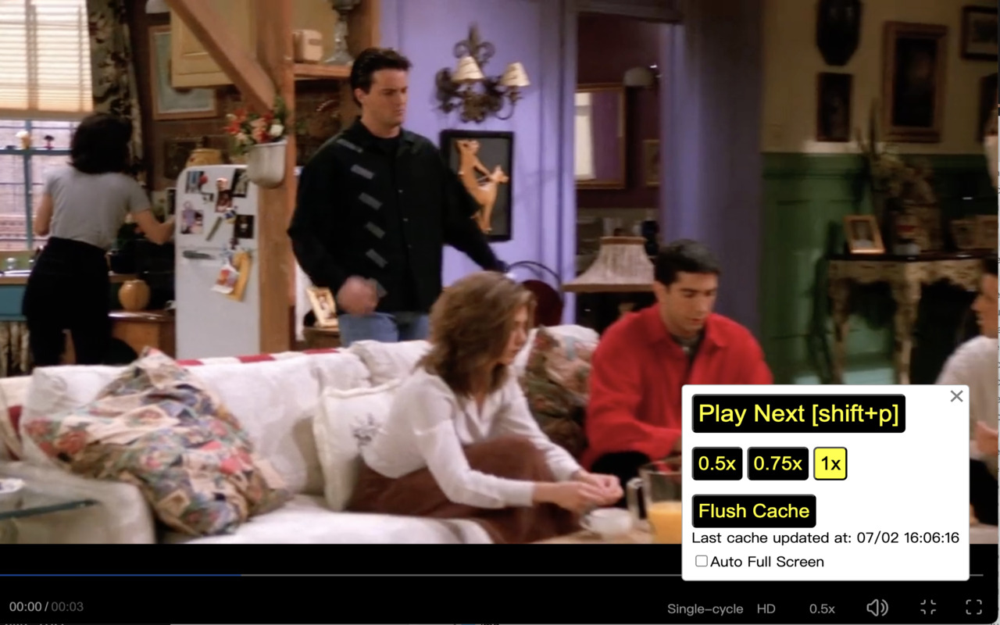

# 小鹅通pc学习插件

## Demonstrate





## Development
```
npm run dev

# then, open chrome browser, in chrome extension, load dist folder.
```


## Installation
[【有道云笔记】小鹅通切换下一个视频谷歌浏览器插件 version2](https://note.youdao.com/s/T7iRlY4i)

## Reference
* [Build a Chrome Extension With React & Webpack](https://www.youtube.com/watch?v=8OCEfOKzpAw)